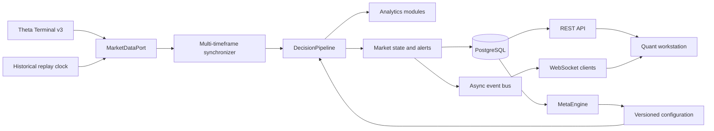

# Architecture

The dependency direction is inward: domain models have no infrastructure imports;
analytics depends only on domain/configuration; application orchestration depends on
ports; adapters implement ports. Both engines receive the same `DecisionPipeline`
instance shape. Only their clock and `MarketDataPort` differ.

## Data convention

ThetaData contract rows are aggregated into signed exposure before reaching the
pipeline. Calls contribute positive and puts negative pressure, weighted by open
interest (volume fallback). Production desks should validate this convention against
their dealer-positioning model and can inject another aggregator without changing the
pipeline.

## Performance

Streaming histories are bounded deques. Multi-timeframe bars are aggregated once per
event-time bucket. WebSocket queues are bounded and drop the oldest update under a slow
consumer rather than blocking market-data processing. PostgreSQL tables are indexed on
time, symbol, regime, and profile. For large installations, partition metrics and
market-state tables by trading date.

